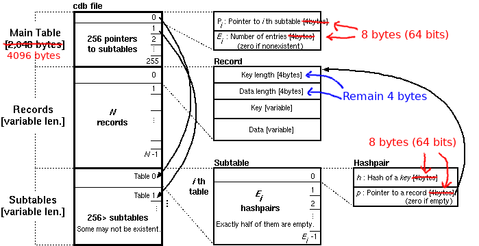

# node constant-db64 [](https://travis-ci.org/ozomer/node-cdb-64)
A [cdb](http://cr.yp.to/cdb.html) implementation in node.js, supporting both read and write capabilities, using 64bit pointers and es6 features.


###### Original image from: http://www.unixuser.org/~euske/doc/cdbinternals/index.html
Notice that the pointers were increased to 64 bits to allow larger database.
The hash-size also supports 64 bits, however [cdb's default hash-function (called djb2)](http://cr.yp.to/cdb/cdb.txt) gives results of only 32 bits.
Therefore this library uses a similar hash function - the first 32 bits are calculated with *djb2*, and the rest 32 bits are taken from the paylod's prefix (yes, it's a very primitive hash function). You can also write your own hash-function that receives a `Buffer` and returns a `BigInt`, and pass this function to the *Readable*/*Writeable* constructor (see following documentation).
Key-Length and Data-Length remain 4 bytes (32 bits) - this allows only 4GB for each key and each value, but saves space if the database contains lots of short key-value pairs (which is the typical use-case).


## Installation
`npm install constant-db64`

## Changes from original v2.0.0
* Replacing error-first-callbacks with promises using async-await
* Writable is not an EventEmitter
* Using `getIterator()` instead of `getNext()`
* Using 64 bits for pointers and hash-values
* Writable and Readable are classes and therefore begin with a capital letter
* Converting keys to buffers instead of hashing utf8 strings directly (with `charCodeAt()`)
* New default hash function that uses all 64bits
* Two Raw-Data-Readers: files, buffers. Users can implement their own data reader (i.e. for online storage buckets)
* Optional cache-wrapper for raw-data readers.

## Changes from v1.0.0
* Renamed `getRecord()` to `get()`
* Renamed `putRecord()` to `put()`
* Added `getNext()`
* Dropped promise support
* Completely rewritten! `get()` calls should be much faster.

## Example
Writable cdb:
```javascript
const Writable = require('constant-db64').Writable;

const writer = new Writable('./cdbfile');
await writer.open();
writer.put('meow', 'hello world');
await writer.close();
console.log('hooray!');
```

Readable cdb:
```javascript
const readable = require('constant-db64').readable;

const reader = new readable('./cdbfile');

await reader.open();

const data = await reader.get('meow');
console.log(data); // results in 'hello world!'

await reader.close();
console.log('awesome!');
```

## Documentation
### Readable cdb
To create a new readable instance:
```javascript
const constantDb = require('constant-db64');
const reader = new constantDb.Readable(filename);
```

You can choose a different hash function by calling:
```javascript
new constantDb.Readable(filename, myHashFunction);
```
Your hash function must return a BigInt.

For faster results that (using cache):
```javascript
const cacheReader = constandDb.rawDataReaders.RawDataReaderCacheWrapper(filename);
const reader = new constantDb.Readable(cacheReader)
```

`new RawDataReaderCacheWrapper(filename, options)` can be called with the following options:
* `blockSize` (default: 4096)
* `blocksLimit` (default: 2000)


`open()`

Opens the file (calls the raw-reader's `open()` function), and immediately caches the header table for the cdb (4098 bytes).

`get(key, [offset])`

Attempts to find the specified key, the data `Buffer` for that key (if found) or undefined (if not found). If an offset is specified, the cdb will return data for the *nth* record matching that key.

`getIterator()`

Returns an async iterator (which also implements `AsyncIterable`), for finding multiple values for the same key. This should be slightly faster than calling `get()` with an offset.

`close()`

Closes the file (calls the raw-reader's `close()` function). No more records can be read after closing.

### Custom Raw-Data Reader

You can also implement your own "Raw-Data Reader" (for example, to read data from an online storage bucket).
Such object should have the following fields:
* **required:** async `read(start, length)` function that returns a `Buffer`
* optional: async `open()` function that will be called when the `Readable` is opened
* optional: async `close()` function that will be called when the `Readable` is closed

To use your raw-data reader, pass it as the first param to: `new Readable(myRawDataReader)` (instead of `filename`), or pass it as the first param to `new RawDataReaderCacheWrapper(myRawDataReader)` (instead of `filename`).

### Writable cdb
To create a new Writable instance:
`new require('constant-cdb64').Writable(filename);`

Unlike raw-data readers, the library **does not** support custom "raw-data writers" (i.e. for writing to an online storage bucket instead of a local file) because creating a constant-db file is more complicated than reading from a constant-db file. In a typical use-case of a **constant database** you would want to create the database file locally, upload it to your online-storage, and use it with your custom raw-data reader.

`open()`

Opens the file for writing. This will overwrite any file that currently exists, or create a new one if necessary.

`put(key, data)`

Writes a record to the cdb.

`close()`

Finalizes the cdb and closes the file. Calling `close()` is necessary to write out the header and subtables required for the cdb!

## Benchmark
`npm run benchmark`
